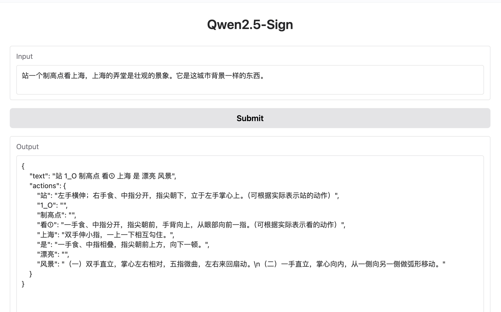

# Qwen2.5-Sign

Qwen2.5-Sign is a Text-to-Chinese-Sign model base on Qwen2.5

## Model Card

- [HuggingFace](https://huggingface.co/thundax/Qwen2.5-1.5B-Sign)

## Preview

- [Qwen2.5-Sign-WebUI](https://huggingface.co/spaces/thundax/Qwen2.5-Sign-WebUI)

<div align="center">
  
</div>

## Finetune Details

- Finetune dataset: [alpaca-zh-text2sign](https://huggingface.co/datasets/thundax/alpaca-zh-text2sign)
- Finetune parameter

| Parameter                   | Value  |
|-----------------------------|--------|
| learning_rate               | 5e-05  |
| train_batch_size            | 4      |
| eval_batch_size             | 4      |
| gradient_accumulation_steps | 8      |
| total_train_batch_size      | 32     |
| lr_scheduler_type           | cosine |
| lr_scheduler_warmup_steps   | 100    |
| num_epochs                  | 4      |

## Quickstart

```python
from transformers import AutoModelForCausalLM, AutoTokenizer

device = "cuda"  # the device to load the model onto

model = AutoModelForCausalLM.from_pretrained(
    "thundax/Qwen2.5-1.5B-Sign",
    torch_dtype="auto",
    device_map="auto"
)
tokenizer = AutoTokenizer.from_pretrained("thundax/Qwen2.5-1.5B-Sign")

text = "站一个制高点看上海，上海的弄堂是壮观的景象。它是这城市背景一样的东西。"
input_text = f'Translate sentence into labels\n{text}\n'
model_inputs = tokenizer([input_text], return_tensors="pt").to(device)

generated_ids = model.generate(
    model_inputs.input_ids,
    max_new_tokens=512
)
generated_ids = [
    output_ids[len(input_ids):] for input_ids, output_ids in zip(model_inputs.input_ids, generated_ids)
]

response = tokenizer.batch_decode(generated_ids, skip_special_tokens=True)[0]
```

## Citation

If you find our work helpful, feel free to give us a cite.

```
@software{qwen2-sign,
  author = {thundax},
  title = {qwen2-sign: A Tool for Text to Sign},
  year = {2025},
  url = {https://github.com/thundax-lyp},
}
```